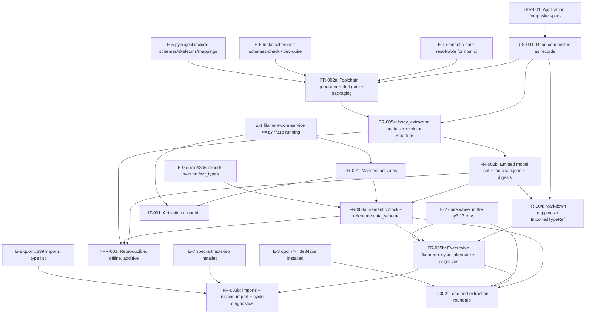

# SR-003: Dependency and ordering review of the issue #3 semantic-module contract spec set

## Summary

Dependency and ordering analysis of the `agent-ix/spec-artifacts-app#3` spec set
(StR-001, US-001, FR-001..FR-005, NFR-001, IT-001, IT-002, TM-001), with every
external dependency the spec names verified read-only on 2026-09-04. The
artifacts the spec depends on all exist and are at the stated versions:
`@agent-ix/semantic-core` 0.1.0 is installed and locked, TypeSpec compiler and
emitter are pinned at 1.15.0, `quoin` main carries FR-070..FR-075 at `3e842ce`,
`quire-rs` main carries FR-069..FR-072 at `17b80e4`, and the FR-035
module-manifest schema at filament-core-service `a77f31e` carries the `semantic`
block and the reference-form `data_schema` (quoin and quire vendor a
byte-identical copy, `sha256:69cf9738…`).

The problem is not a missing artifact. It is that **FR-003 specifies a
`semantic.imports` shape the upstream contract does not have**: FR-035, quoin
and quire all type `imports` as `{"<org>/<repo>": "<exact semver>"}`, while
FR-003 declares it as a module-to-type-name-list map. Measured, not asserted:
loading this branch's `spec_artifacts_app/` with quire 0.46.0 yields
`archetype_names() == []`; replacing the type list with
`agent-ix/spec-artifacts-iso: 0.2.0` and changing nothing else yields
`['Application Spec', 'ApplicationSpec', 'MasterRequirements']`. The module as
FR-003 specifies it does not load at all today, and quire-rs#394 is why that
failure is silent rather than diagnosed. A second upstream mismatch sits beside
it: quoin resolves `semantic.exports` and `data_schema` against `object_types`
only, and this module (like `spec-artifacts-iso`) declares its types as
`artifact_types`. Both defects are already filed upstream — `agent-ix/quoin#339`
and `agent-ix/quoin#336` — and neither is named anywhere in this spec set.

Two ordering cycles in the stated prerequisite edges must be broken before
`spec-to-plan` can sequence the work, and seven enablement items that no
requirement owns must be carried as explicit plan tasks.

## Verdict

**Not ready for `spec-to-plan` as written.** Two highs (FND-201, FND-202) are
upstream-contract mismatches that make FR-003-AC-1, AC-3, AC-4, AC-5, FR-005-AC-1
and every IT-002 step unsatisfiable against any engine that exists today; a
third (FND-203) is a four-node cycle in the stated `Upstream` edges of
FR-002..FR-005. Once FND-201..FND-203 are resolved, the topological order in
this document is the sequence to plan against. No spec artifact was edited by
this review.

## Findings

| ID | Severity | Summary | Refs | Escape Cause |
|----|----------|---------|------|--------------|
| FND-201 | high | FR-003 declares `semantic.imports` as a map from module reference to a list of type names ("`semantic.imports` SHALL map each imported module reference … to the list of type names this module references from it"), and the manifest authors it that way. The FR-035 schema at filament-core-service `a77f31e` — the copy quoin and quire vendor byte-identically as `sha256:69cf9738…` — types `imports` as `additionalProperties: {type: string, pattern: ^[0-9]+\.[0-9]+\.[0-9]+$}`: a package pinned to an exact version, nothing more. Ajv against that schema rejects the manifest with `/semantic/imports/agent-ix~1spec-artifacts-iso must be string`; quire validates the block against the same vendored copy (`src/semantic/contract.rs` step 3) and quoin parses `imports: Record<string, string>` (`src/semantic/manifest.ts:208`). Measured: `quire.Registry.load_from(['spec_artifacts_app'])` at 0.46.0 returns `[]` for this branch, and returns all three archetypes when the only change is `imports: {agent-ix/spec-artifacts-iso: 0.2.0}`. FR-003-AC-1 ("validates against the bundled FR-035 schema with the `semantic` block present"), AC-3, AC-4 and AC-5 are therefore unsatisfiable, and FR-005-AC-1 and every IT-002 step fail behind them. The type-list form is an upstream change filed as `agent-ix/quoin#339` (OPEN, Backlog); no artifact in this spec set names it. | FR-003 Behavior, FR-003-AC-1, AC-4, AC-5, IT-002, spec.md Out of Scope | missing-requirement |
| FND-202 | high | FR-003 puts `data_schema` on `artifact_types[]` and sets `exports: [ApplicationSpec, MasterRequirements]`, which are artifact types; `object_types` is `[]`. Quoin resolves both against `object_types` only — `src/semantic/manifest.ts:175-188` emits `semantic.unknown-export` ("names X, which object_types does not declare") and `src/semantic/data-schema.ts:141` addresses the locus as `object_types[…].data_schema` — so quoin refuses this module at install time regardless of FND-201. Quire is the tolerant one (`all_archetypes()` spans both sections), which is why the two engines disagree about the same manifest. Filed upstream as `agent-ix/quoin#336` (OPEN) and reached the same way by `spec-artifacts-iso`; named in no artifact here. Nothing in the spec states which engine's acceptance FR-003-AC-1 is measured against, so the criterion reads as green on quire and red on quoin. | FR-003 Outputs, FR-003-AC-1, AC-2, spec.md Out of Scope | missing-requirement |
| FND-203 | high | The stated `Upstream` prerequisites form a four-node cycle: FR-004 lists FR-003; FR-003 lists FR-002; FR-002 lists FR-005 ("the locators and skeletons the models type"); FR-005 lists FR-004. FR-004 and FR-005 are additionally mutually upstream of each other. The `relationships` frontmatter states only FR-003→{FR-001,FR-002}, FR-004→FR-002, FR-005→FR-002, so the frontmatter graph and the prose `Dependencies` graph disagree, and the prose one is not a DAG. `spec-to-plan` cannot sequence it. Break it with the splits in **Cycles** below (FR-002a/FR-002b, FR-003a/FR-003b, FR-005a/FR-005b), or reverse the FR-002→FR-005 edge as `spec-objects-business#4` did for its FR-002/FR-004 pair. | FR-002 Dependencies, FR-003 Dependencies, FR-004 Dependencies, FR-005 Dependencies | wrong-requirement |
| FND-204 | medium | The quire wheel exposing `extract_semantic` is not reachable from the environment the suite runs in. `poetry run python -c "import quire"` fails (`ModuleNotFoundError`); the only 0.46.0 install is a Python 3.10 user site while the project pins `>=3.13,<3.14`. pypi.ix serves quire 0.46.0, but committing a `local-pypi` source ref is forbidden, so the wheel is provisionable only out-of-band — which is what `make dev-quire` is for and what `agent-ix/quire-rs#392` (OPEN) tracks. The Makefile has no `dev-quire` target today. Every semantic row of the matrix (TC-013, TC-017, TC-034, TC-035, and the record rows behind TC-023/TC-028/TC-029) sits behind this one enablement step, and NFR-001 correctly requires them to fail rather than skip — so until E-2 is done the suite is red, not green. | NFR-001 Scope, FR-003 Inputs, IT-002 Preconditions, tests.md | correct-requirement-no-evidence |
| FND-205 | medium | Every engine the feature work depends on exists only on an untagged `main`. `git tag --contains a77f31e` is empty in filament-core-service (latest v0.8.34); no quoin tag contains `3e842ce` (latest v0.23.1); no quire-rs tag contains `17b80e4` (latest v0.45.0); no spec-artifacts-iso tag contains `6686f11` (latest v0.18.0). FR-001-AC-2..AC-4, IT-001 and StR-001-VC-1 need a *running* filament-core-service at or after `a77f31e`, which no release provides. The spec names FR-035 by name only — never by revision — so nothing in the spec set records that the activation boundary needs an unreleased service. | FR-001, FR-003 Inputs, IT-001, spec.md References | missing-requirement |
| FND-206 | medium | FR-003-AC-4 requires every `ImportedTypeRef` to name a module and type that `semantic.imports` declares, and the manifest imports `agent-ix/spec-artifacts-iso` types `StR, US, FR, NFR, IT, TC`. That module declares its semantic block only on `main` (`6686f11`, manifest `version: 0.2.0`, `imports: {}`), it carries no release tag, and `pip index versions spec-artifacts-iso` against pypi.ix finds no distribution — so no installed module provides the import. Quoin's `resolveImports` (FR-075) emits `semantic.import-unresolved` unless the provider is installed at exactly the declared version, and FR-003-AC-5's cycle graph needs the same installed set. The provider module is an untracked enablement prerequisite (E-7) with no requirement of its own. | FR-003-AC-4, FR-003-AC-5, FR-004-AC-4 | missing-requirement |
| FND-207 | medium | `spec.md` Out of Scope defers the `MasterRequirements` ownership overlap to `agent-ix/quoin#345`, which does not exist (`gh issue view 345 --repo agent-ix/quoin` → "Could not resolve to an issue"). The real ticket is `agent-ix/quoin#338`, "MasterRequirements is declared by two ecosystem modules, so a bare-token reference resolves first-wins" (OPEN), which names both this module and `spec-artifacts-iso`. A deferral pointing at a nonexistent number is an untracked deferral: `quire validate` already reports `DuplicateArchetype: MasterRequirements` on this tree. | spec.md Out of Scope | wrong-requirement |
| FND-208 | medium | The emitted bundle is not self-contained, and no dependency delivers the missing half. `ApplicationSpec.json`, `MasterRequirements.json` and `Provenance.json` `$ref` `https://schemas.agent-ix.org/semantic-core/0.1.0/{ClauseRef,FieldDecl,SemanticId,…}.json`, which FR-002 deliberately excludes from the shipped bundle ("those ship in the semantic-core bundle quoin and quire vendor, never here"). Quoin and quire do vendor it, so their resolution is fine; the named downstream consumers — `agent-ix/quire-contract-ir#52`, `agent-ix/filament-core-data#36` — are plain schema consumers, and this module's payload (`package.json` `files`, `pyproject.toml` `include`) ships no semantic-core bundle and declares no runtime dependency that would. `semantic.semantic_core: 0.1.0` is the only pointer, and it is a version string, not a delivery. NFR-001's "resolve every `$ref` with no network read" therefore holds only for a consumer that already vendors semantic-core. | FR-002 Behavior, FR-002-AC-3, NFR-001 Statement, FR-004 Dependencies | correct-requirement-no-evidence |
| FND-209 | medium | Packaging enablement has no owner. FR-004 Outputs requires `mappings.yaml` and `mappings.schema.json` "shipped with the module in the sdist, the wheel, and the npm payload", and FR-002 ships `schemas/`, but `pyproject.toml` `include` lists exactly one path — `spec_artifacts_app/manifest.yaml`. `package.json` `files` is already correct (`schemas/`, `skeletons/`, `mappings.yaml`, `mappings.schema.json`). No AC checks the Python payload, so the wheel can ship without the schemas and every criterion still passes. The plan must carry the `pyproject.toml` include as one packaging task under FR-002a. | FR-002 Outputs, FR-004 Outputs, pyproject.toml | missing-requirement |
| FND-210 | medium | `@agent-ix/semantic-core` 0.1.0 resolves only from npm.ix: `package-lock.json` records `"resolved": "http://npm.ix/@agent-ix/semantic-core/-/semantic-core-0.1.0.tgz"`, the public packages are `agent-ix/filament-core-data#11` (OPEN), and FR-002-CON-3 forbids a repository `.npmrc`. `npm ci` — and therefore `make schemas` and `make schemas-check` — cannot run in any workflow that does not route the `@agent-ix` scope. NFR-001 states the npm-configuration precondition honestly, but no requirement states the consequence: the FR-002 drift gate is a developer-machine gate, not a CI gate, and `.github/workflows/ci.yml` sets up no Node step at all. | FR-002-CON-3, NFR-001 Scope, .github/workflows | correct-requirement-no-evidence |
| FND-211 | low | FR-002 Outputs makes `make schemas`, `make schemas-check` and `make manifest-digests` obligations, NFR-001 measures three of its four metrics through them, and FR-003 Outputs folds `make manifest-digests` into `make schemas` — but the Makefile declares none of these targets, nor `make dev-quire`. They are the module's own work rather than an external dependency, so this is an ordering note, not a gap: they are the first task of FR-002a and every NFR-001 metric row is blocked until they exist. | Makefile, FR-002 Outputs, FR-003 Outputs, NFR-001 | correct-requirement-no-evidence |
| FND-212 | low | `spec.md` References cite "`agent-ix/filament-core-data` FR-031..FR-034 and ADR-0005 — semantic-core grammar, scalars, JSON Schema projection, and TypeSpec as the structural source". FR-031..FR-034 exist; no `ADR-0005*` file exists in that repository. The dependency resolves to a decision that was never written down, exactly as `spec-objects-business#4` FND-148 recorded. No requirement depends on the file's existence. | spec.md References, FR-002 Dependencies | wrong-requirement |
| FND-213 | low | `semantic.mappings` is typed `{items: {type: string, minLength: 1}}` in FR-035 and neither quoin nor quire checks the names against a registry, so FR-003-AC-1's assertion that the block carries `mappings: [frontmatter, section, typed-table, sysml-fence, ocl-clause, provenance]` checks the manifest against this spec, not against an upstream vocabulary. `spec-artifacts-iso` declares a different set (`table`, `list`, `token` in addition), and nothing reconciles them. The stated dependency on "quoin FR-071/FR-072 mapping names" has no enforcing consumer. | FR-003-AC-1, FR-003 Outputs | correct-requirement-no-evidence |
| FND-214 | low | IT-002-SC-03 asserts the reference-form `data_schema` is "reported verbatim rather than resolved into a stored snapshot (filament-core-service#23)". #23 is OPEN and is a *filament-core-service* registry-snapshot change, while IT-002's system under test is the quire engine — so the criterion asserts the current quire behaviour and cites an issue in a service the test never calls. When #23 lands it changes nothing about what IT-002 measures; the row will not announce the arrival the way the FR-003-AC-8 expected-failure row does. | IT-002-SC-03, spec.md Out of Scope | wrong-requirement |
| FND-215 | low | The four blockers `spec.md` does name (quire-rs#392, #221, #394, #391) are all OPEN and all correctly characterised, and #388, quoin#293, filament-core-data#34 and #35 are all CLOSED as the spec assumes. Recorded as a positive result so a later reader does not re-verify: the only mis-stated external references in the set are `quoin#345` (FND-207) and the two unnamed quoin defects (FND-201, FND-202). | spec.md Out of Scope, US-001 Dependencies | correct-requirement-no-evidence |

## External Dependency Verification

Read-only checks performed on 2026-09-04. "Stated" is what the spec names;
"Found" is what exists.

| Dependency | Stated | Found | Status |
|---|---|---|---|
| `@agent-ix/semantic-core` | 0.1.0 (filament-core-data#35), for `ClauseRef`, `SourceLocus`, `SemanticId` | installed 0.1.0; `main.tsp` declares `SemanticId`, `SourceLocus {sourceIdentity, path, startLine, startColumn, endLine?, endColumn?}`, `ClauseRef {language, clauseId, sourceSpan?}`; lockfile resolves to `http://npm.ix/` | exists, correct version; npm.ix-only (FND-210) |
| TypeSpec toolchain | compiler and emitter 1.15.0, committed lockfile | exact devDependencies at 1.15.0, `package-lock.json` committed, no `file:`/`link:`, no `.npmrc` in the repo | exists, correct version |
| quoin FR-070..FR-075 | agent-ix/quoin#293 | #293 CLOSED; main HEAD `3e842ce` carries FR-070..FR-075 and `src/semantic/{manifest,data-schema,package-manifest}.ts`; installed CLI is `0.23.1-2-g3e842ce`, i.e. a main build | exists on main; untagged (FND-205); `imports` and `exports` shapes disagree with FR-003 (FND-201, FND-202) |
| quire-rs FR-069..FR-072 | agent-ix/quire-rs#388 | #388 CLOSED; main HEAD `17b80e4` carries FR-069..FR-072; `read_semantic_block` validates against the vendored FR-035 block schema; `all_archetypes()` spans `artifact_types` and `object_types` | exists on main; untagged (FND-205) |
| quire wheel with `extract_semantic` | provisioned by `make dev-quire`; quire-rs#392 blocks committing it | 0.46.0 present only in a Python 3.10 user site; project env is 3.13 and has no `quire`; pypi.ix serves 0.46.0; no `dev-quire` target exists | not provisioned (FND-204, FND-211) |
| filament-core-service FR-035 with the `semantic` block | the activation and validation contract | `origin/main` `a77f31e` (#21/#22) carries it; quoin and quire vendor byte-identical copies (`sha256:69cf9738…`); top level and the `semantic` block are both `additionalProperties: false`; `imports` is `Record<package, semver>` | exists on main; no release contains it (FND-205); `imports` shape conflicts with FR-003 (FND-201) |
| filament-core-service#23 | reference-form `data_schema` not resolved at activation | OPEN | exists (FND-214) |
| `agent-ix/spec-artifacts-iso` types `StR, US, FR, NFR, IT, TC` | declared in `semantic.imports` | main `6686f11`, manifest `version: 0.2.0`, semantic block exports all six plus `master-requirements`, `index`, `log`, `Glossary`; `imports: {}`; untagged; absent from pypi.ix | exists on main only (FND-206) |
| quire-rs#392, #221, #394, #391 | the four named blockers | all OPEN, all as characterised | exists (FND-215) |
| filament-core-data#34, #35 | semantic IR v1.1 and semantic-core grammar | both CLOSED | exists |
| filament-core-data#11, #21, #22, #23, #36; quoin#290, #291; quire-contract-ir#52 | scope boundaries and downstreams | all OPEN | exists |
| filament-core-data FR-031..FR-034, ADR-0005 | semantic-core grammar, scalars, projection, TypeSpec decision | FR-031..FR-034 present; no `ADR-0005*` file | ADR missing (FND-212) |
| quoin#345 | the MasterRequirements ownership deferral | does not exist; the real ticket is quoin#338 | wrong reference (FND-207) |
| quoin#336, #339 | not named anywhere in the spec set | both OPEN; they are exactly the two upstream mismatches FND-201 and FND-202 describe | unnamed dependency (FND-201, FND-202) |

## Classification

| Requirement | Class | Rationale |
|-------------|-------|-----------|
| StR-001 | Feature (root need) | Stakeholder need for application composite specs; no implementation of its own |
| US-001 | Feature (root story) | The consumer's story realised by FR-002..FR-005 |
| FR-001 | Enablement | Manifest activation against filament-core; already satisfied at 0.2.0 and the gate every later manifest change must keep passing |
| FR-002 | Mixed — split | FR-002a (TypeSpec toolchain, generator, `$id`/version guard, drift gate, packaging) is Enablement with no consumer-visible behaviour; FR-002b (the emitted model set, `toolchain.json`, digests) is the Feature payload consumers read |
| FR-003 | Mixed — split | FR-003a (the `semantic` block, reference-form `data_schema`, digest refresh) is Enablement: a binding, not a behaviour an author sees. FR-003b (`semantic.imports`, missing-import and cycle diagnostics) is Feature-adjacent and consumes FR-004/FR-005 content |
| FR-004 | Feature | The Markdown-to-record mapping is what a consumer actually reads instead of prose; `mappings.yaml` is the published artifact |
| FR-005 | Mixed — split | FR-005a (the `body_extraction` locators and the skeletons' section structure) is Enablement that FR-002 and FR-004 both consume; FR-005b (executable fixtures, `sysml` alternate, negative counterparts) is the Feature authoring contract |
| NFR-001 | Constraint | Reproducibility, offline resolution and additive compatibility bound on FR-002/FR-003; implements nothing |
| IT-001 | Verification | Verifies FR-001 against a running filament-core-service |
| IT-002 | Verification | Verifies FR-003 and FR-005 at the quire engine boundary |

Enablement outside the FR set that the plan must carry as explicit tasks — none
has a requirement of its own today:

1. **E-1** filament-core-service released or deployed at or after `a77f31e`, for FR-001-AC-2..AC-4, IT-001 and StR-001-VC-1 (FND-205).
2. **E-2** quire 0.46.0 with `extract_semantic` reachable from the project's Python 3.13 poetry environment, plus the `make dev-quire` target that provisions it (FND-204, FND-211).
3. **E-3** quoin installed at or after `3e842ce` — satisfied locally today (`0.23.1-2-g3e842ce`), unreleased everywhere else (FND-205).
4. **E-4** `@agent-ix/semantic-core` 0.1.0 resolvable wherever `npm ci` runs, or the drift gate's developer-machine-only scope stated as a requirement (FND-210).
5. **E-5** packaging: `pyproject.toml` `include` for `schemas/*.json`, `skeletons/*.md`, `mappings.yaml`, `mappings.schema.json` (FND-209).
6. **E-6** `make schemas`, `make schemas-check`, `make manifest-digests`, `make dev-quire` (FND-211).
7. **E-7** `spec-artifacts-iso` installed under the Filament module root at the version `semantic.imports` declares (FND-206).

Upstream feature work that is a hard prerequisite of FR-003 as written, and is
tracked in another repository:

8. **E-8** `agent-ix/quoin#339` — a type list on `semantic.imports`, which requires an FR-035 schema change plus quoin and quire readers (FND-201).
9. **E-9** `agent-ix/quoin#336` — quoin resolving `semantic.exports` and `data_schema` against `artifact_types` as well as `object_types` (FND-202).

## Dependency Graph

Edges are the explicit prerequisites the spec states, after the three splits
proposed in **Cycles**. External prerequisites appear as E-1..E-9.

External prerequisites by requirement — each is a hard edge:

| Requirement | External prerequisite |
|---|---|
| FR-001 | filament-core-service FR-035, FR-026, FR-034 at revision `a77f31e` (E-1) |
| FR-002 | `@agent-ix/semantic-core` 0.1.0 (filament-core-data FR-031..FR-033, #35); TypeSpec 1.15.0; E-4, E-5, E-6 |
| FR-003 | quoin FR-070, FR-073, FR-075 (#293); quire-rs FR-069 (#388); the FR-035 `semantic` block at `a77f31e`; **E-8 and E-9 for AC-1, AC-3, AC-4, AC-5** |
| FR-004 | quoin FR-071, FR-072; quire-rs FR-008 byte-exact section slices; semantic-core `ClauseRef`/`SourceLocus`; E-7 for the `ImportedTypeRef` check |
| FR-005 | quoin FR-071, FR-072; quire-rs FR-070..FR-072; the quire wheel (E-2, quire-rs#392) |
| NFR-001 | E-2, E-4, E-6; `.gitattributes` LF pinning (present on this branch) |
| IT-001 | E-1 |
| IT-002 | E-2, E-3, and E-8/E-9 for the load to succeed at all; quire-rs#394 and #221 keep step 5 an expected failure; filament-core-service#23 for SC-03 |

## Topological Order (suggested implementation sequence)

1. **Enablement, parallelizable**: E-4 (semantic-core reachable where `npm ci` runs), E-5 (`pyproject.toml` include), E-6 (the four Make targets), E-2 (quire wheel in the py3.13 env), E-3 (quoin from main), E-7 (spec-artifacts-iso installed), E-1 (filament-core-service at or after `a77f31e`).
2. **FR-002a** — TypeSpec toolchain, `$id`/manifest-version guard, deterministic renderer, `make schemas` / `make schemas-check`, packaging.
3. **FR-005a** — the `body_extraction` locators and the skeletons' section and table structure; these fix the field set FR-002b types and the columns FR-004 maps.
4. **FR-002b** — the models in `typespec/main.tsp`, the 39-file emitted bundle, `toolchain.json`, the digest computation.
5. **FR-004** — `mappings.yaml`, `mappings.schema.json`, the Python reference-mapping oracle, the record tests.
6. **FR-003a** — manifest `version` bump, the `semantic` block minus `imports`, reference-form `data_schema`, `make manifest-digests`. Blocked on **E-9** for quoin acceptance.
7. **FR-005b** — executable fixtures, the `sysml` alternate skeleton, the eight negative counterparts.
8. **FR-003b** — `semantic.imports`, the missing-import and cycle diagnostics. Blocked on **E-8**; until #339 lands, the only shippable form is `imports: {"agent-ix/spec-artifacts-iso": "<version>"}` with the type list carried outside the manifest.
9. **NFR-001** verification (TC-030, TC-032, TC-033; TC-031 manual), **IT-002** (TC-013, TC-017, TC-034, TC-035), **IT-001** re-run against E-1.

FR-002a and E-1..E-7 are the only genuinely parallel work. From step 3 onward
each step consumes the previous step's bytes — locators, then fields, then
mapping entries, then digests — so nothing in the feature layer parallelises.

## What Is Shippable Today

"Today" means: quoin and quire built from `main`, the quire 0.46.0 wheel
provisioned out-of-band, no upstream change landed.

| Requirement | Shippable now | Blocked, and by what |
|---|---|---|
| FR-001 | AC-1 (schema test against the bundled FR-035 copy) | AC-2..AC-4 — E-1, no released service carries `a77f31e` |
| FR-002 | All eleven ACs and all five CONs — the toolchain, semantic-core and lockfile are in place | Nothing, once E-4/E-5/E-6 are done; the drift gate stays developer-machine-only |
| FR-003 | AC-2, AC-6 (schema half), AC-7, CON-1, CON-2 | AC-1, AC-3, AC-4, AC-5, CON-3 — E-8 (`imports` type list) and E-9 (`exports` over `artifact_types`); AC-6 engine half and AC-8 — quire-rs#221, #394 |
| FR-004 | AC-1, AC-2, AC-3, AC-5, AC-6, AC-7, AC-8, all three CONs — the mapping and its oracle are module-local data plus Python | AC-4's "names a module and a type that `semantic.imports` declares" — E-8; the record-validating half of AC-3/AC-8 also needs E-2 |
| FR-005 | AC-2, AC-4, AC-5, AC-6, AC-7, all three CONs | AC-1 and AC-3 — `validate_document` requires the module to load, which E-8/E-9 gate today; also E-2 |
| NFR-001 | Metrics 1, 3, 4 | Metric 2 is a declared manual gate (not a defect); all four need E-6 |
| StR-001 | Neither VC | VC-1 — E-1; VC-2 asserts a `minijinja-cli` template demonstration this spec set forbids (base review FND-007) |
| IT-001 | Nothing | E-1 |
| IT-002 | Nothing | Every step — the module does not load today (FND-201); plus E-2, E-3, quire-rs#394/#221 for step 5, filament-core-service#23 for SC-03 |

Net: **FR-002 and the data half of FR-004 are shippable now**; FR-005 is
shippable as authored artifacts but not as a verified gate; FR-003 is half
shippable and half waiting on two upstream quoin tickets; every integration
row waits on enablement.

## Cycles

Two cycles in the stated `Upstream` edges (FND-203), both broken by splitting
requirements that today mix an enablement half with a feature half:

- **FR-004 ↔ FR-005.** FR-004 Dependencies list FR-005 ("the locators and skeletons"); FR-005 Dependencies list FR-004. Break: FR-005a (locators + skeleton section structure) precedes FR-004; FR-005b (executable fixtures, negatives, record validation) follows it.
- **FR-002 → FR-005 → FR-004 → FR-003 → FR-002.** FR-002 Dependencies list FR-005; FR-005 lists FR-004; FR-004 lists FR-003; FR-003 lists FR-002. Break: with FR-005 split as above, FR-002a precedes FR-005a, FR-005a precedes FR-002b, and FR-003 splits into FR-003a (block + `data_schema`, consumed by FR-005b) and FR-003b (`imports`, consuming FR-005b), leaving the acyclic chain FR-002a → FR-005a → FR-002b → FR-004 → FR-003a → FR-005b → FR-003b.

The `relationships` frontmatter graph (FR-003→{FR-001, FR-002}, FR-004→FR-002,
FR-005→FR-002) is already acyclic; it is the prose `Dependencies` sections that
are not, and they are the ones `spec-to-plan` reads for ordering. After the
three splits both graphs agree and no cycle remains.
