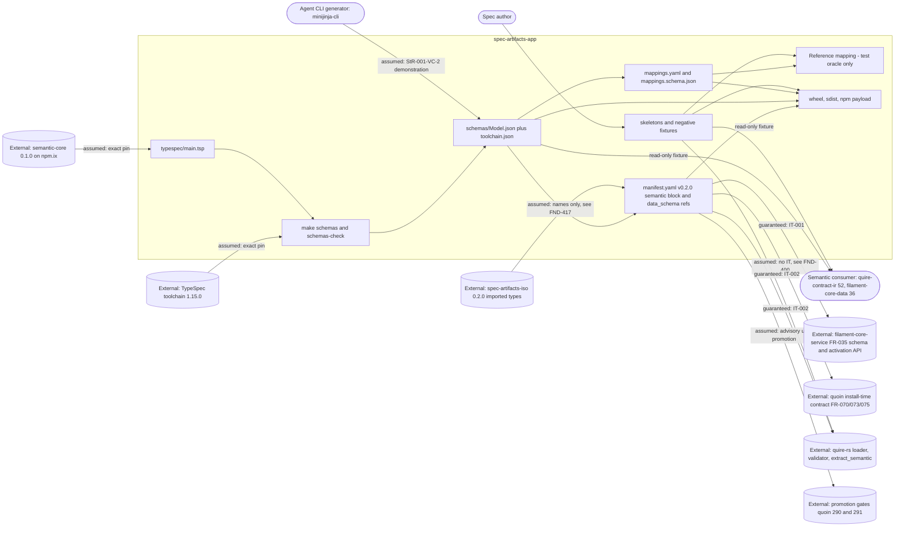

# SR-003: Scope and boundary review of the issue #3 semantic-module contract spec

## Summary

This review draws the boundary of `spec-artifacts-app` as specified on
`spec/3-semantic-module-contract`, allocates every StR/US/FR/NFR/IT to an
owning component and a responsibility class, and checks each responsibility
the spec claims, disclaims, or leans on against the component that actually
owns it: quoin FR-070..FR-075 (the `semantic` block, the Markdown mappings,
`data_schema` by digest, legacy forms, package derivation), quire-rs
FR-008 and FR-069..FR-072 (byte-exact slices, the contract at load, typed
`Properties`, clauses, the extraction surface), filament-core-data FR-031..
FR-034 (semantic-core grammar and projection), and filament-core-service
FR-035 (the module-manifest schema, read at `origin/main` a77f31e, the
CR-003 revision that adds the block). It also read the module's own
`manifest.yaml`, `package.json`, `pyproject.toml`, and shipped frontmatter
schemas, the ticket body of agent-ix/spec-artifacts-app#3, and the one
merged precedent in the same wave, `spec-artifacts-iso` 0.2.0.

The boundary is drawn correctly in the large. The module owns TypeSpec
source, emitted schemas, the manifest block, the mappings declaration, and
the fixture set; it does not re-specify extraction, install-time rejection,
or IR lowering, and it says out loud that the reference mapping is a test
oracle. Twenty findings: five high, ten medium, five low.

The five highs are all one shape — the spec allocates work to a neighbour
surface that is scoped to **object types**, while everything this module
publishes is an **artifact type**. `semantic.exports` admits object-type
names only (quoin FR-070-AC-4, and the FR-035 schema says so in the key's
own description), `data_schema` by digest is specified for "an object
type's" schema (quoin FR-073), and the loader fails "the module's object
types" on a contract breach (quire-rs FR-069). This module declares
`object_types: []`. The gap is real and already filed as agent-ix/quoin#336,
but no requirement and no Out of Scope entry names it, so FR-003 specifies a
manifest the install-time owner rejects, and the strict expected failure the
matrix uses as its announcement mechanism cannot ever flip.

## Verdict

**Conditional pass.** The in/out-of-scope split of `spec/spec.md` is sound
and no requirement duplicates a quoin, quire-rs, or filament-core-data
responsibility outright. Before tasking, the five high findings need a
disposition: FND-400 and FND-412 need agent-ix/quoin#336 named as the
blocking gate for `exports` and for TC-017, FND-401 needs
`semantic.imports` reconciled with the shape the FR-035 schema types,
FND-402 needs a named owner for producing the FR-004 record in production,
FND-403 needs a real ticket for the `MasterRequirements` overlap in place of
the unfiled `agent-ix/quoin#345`, and FND-404 needs the `## Properties` and
`sysml` forms either dropped from the skeletons or reconciled with quoin
FR-071. None of these moves the module's boundary; each closes a gap at its
edge.

## System Context

## In-Scope Responsibilities

What the module guarantees (spec.md In Scope, FR-001..FR-005, NFR-001):

- Publish `manifest.yaml` conforming to filament-core-service FR-035 and
  activating idempotently against `POST /api/v1/modules/activate` (FR-001).
- Author one TypeSpec model per declared artifact type importing
  `@agent-ix/semantic-core` 0.1.0, and emit the JSON Schema 2020-12
  projection of every model, support model, and scalar under
  `spec_artifacts_app/schemas/`, with `$id`, `$ref`, inline-property,
  determinism, and drift-check rules (FR-002).
- Carry the quoin FR-070 `semantic` block at `contract_version: 1.0.0`,
  reference-form `data_schema` per exported type, and a declared `imports`
  set, at manifest version 0.2.0 (FR-003).
- Publish `mappings.yaml` and `mappings.schema.json` declaring, per model,
  the authority and round-trip policy, the dropped frontmatter keys, and one
  mapping entry per property, plus the cell-level parse rules (FR-004).
- Ship every skeleton as an executable positive fixture with a negative
  counterpart per demonstrated rule, and add optional `body_extraction`
  locators to both artifact types (FR-005).
- Keep the projection reproducible byte-for-byte, offline-resolvable, and
  additively compatible, and keep every added locator optional (NFR-001).

What the module explicitly disclaims (spec.md Out of Scope):

- filament-core-service behaviour beyond the FR-035 manifest schema.
- The quire-rs validation and extraction engine.
- Render templates and `template_ref`.
- Any edit to a corpus repository; the corpus promotion gate is quoin#291.
- Generated-language fixtures for the application types, allocated to
  filament-core-data#21/#22/#23 behind quoin#290 (see FND-414).
- Publishing the quire wheel exposing `extract_semantic` (quire-rs#392).
- Naming what a module load refused (quire-rs#221, quire-rs#394).
- Record validation of a legacy `object:` artifact (quire-rs#391).
- Resolving a reference-form `data_schema` into a stored snapshot at
  activation (filament-core-service#23).
- Deciding which module owns `MasterRequirements`, deferred to a ticket that
  does not exist (see FND-403).
- Closing the `status` frontmatter vocabulary; making the offline run a CI
  job; any UI implementation change.

## External Dependencies

| Dependency | Type | Assumed or Guaranteed | Contract |
|------------|------|------------------------|----------|
| filament-core-service module-manifest schema (FR-035 CR-003, `origin/main` a77f31e) | JSON Schema, bundled at `tests/fixtures/module-manifest.schema.json` | Guaranteed | FR-001-AC-1, FR-003-AC-1, FR-003-AC-6, FR-003-AC-7 (TC-011, TC-016, TC-036); revision not pinned in any requirement, and one of AC-6's four rejections is not the schema's (FND-406) |
| filament-core-service activation API (`POST /api/v1/modules/activate`, registry reads) | HTTP | Guaranteed | IT-001 roundtrip, FR-001-AC-2..AC-4; not runnable in this package (matrix rows are open) |
| filament-core-service#23 (resolved `data_schema` in registry snapshots) | Upstream issue | Assumed | IT-002-SC-03 asserts the reference is reported verbatim until it lands; the issue is scoped to **ObjectType** snapshots (FND-402) |
| Quoin install-time contract (FR-070 block, FR-073 digest verification, FR-075 package derivation) | Local CLI over the filesystem | **Assumed, with no contract test** | No IT and no AC exercises `quoin module install`; FR-070-AC-4 rejects this module's `exports` (FND-400) and FR-075 is unacknowledged (FND-418) |
| Quoin published Markdown mappings (FR-071 `## Properties` and the `sysml` subset, FR-072 `## Invariants` clauses) | Golden fixtures published under quoin `tests/fixtures/semantic-module/` | Assumed | FR-004 and FR-005 author these forms; the `## Properties` and `sysml-fence` uses exceed the published grammar (FND-404, FND-405) |
| Quire engine: loader FR-069, typed extraction FR-070, clauses FR-071, surface FR-072, slices FR-008 | Python wheel exposing `extract_semantic`, provisioned by `make dev-quire` | Guaranteed | IT-002, FR-003-AC-3, FR-005-AC-1; the wheel is unpublished (quire-rs#392) and FR-069's contract enforcement is object-type-scoped (FND-402, FND-412) |
| quire-rs#221, #394 (a refused load names nothing) | Upstream defects | Assumed | FR-003-AC-6 and FR-003-AC-8 carry them as declared expected failures; correctly recorded |
| quire-rs#391 (`object:` record validated as `{}`) | Upstream defect | Assumed | Disclaimed by convention; the module's own frontmatter schemas still admit `object:` (FND-415) |
| `@agent-ix/semantic-core` 0.1.0 (filament-core-data#35, published by #11) | npm package on npm.ix, JSON Schema bundle at `https://schemas.agent-ix.org/semantic-core/0.1.0/` | Assumed | Exact pin in `package.json`, committed lockfile (FR-002-CON-3); pinned in the *published* root package (FND-411) |
| `@typespec/compiler` and `@typespec/json-schema` 1.15.0 | npm devDependencies | Assumed | Exact pin plus `package-lock.json`, recorded in `toolchain.json` (FR-002-AC-11) |
| Machine npm configuration routing the `@agent-ix` scope | Developer environment, outside the repository | Assumed | NFR-001 Scope states it explicitly and admits an unrouted machine cannot reproduce the bundle; correctly declared |
| `spec-artifacts-iso` 0.2.0 exported types | Read-only names, referenced through `ImportedTypeRef`, never `$ref` | Assumed | FR-003-AC-4, FR-004-AC-4; the exported spelling (`master-requirements`) is not the one this module writes (FND-417) and the `MasterRequirements` type name collides (FND-403) |
| filament-core-data#21/#22/#23 (language codegen backends) | Downstream generators | Assumed | Named as the owner of generated-language fixtures; they are backends, not fixture producers (FND-414) |
| quire-contract-ir#52, filament-core-data#36 | Downstream read-only consumers | Assumed | No contract; and no golden record is shipped for them to consume (FND-408) |
| Promotion gates quoin#290 (publish and enforce) and quoin#291 (corpus census) | Program gates | Assumed | spec.md Out of Scope names both; the schemas are enforcing only inside this suite until they clear |
| Corpus repositories | Downstream, never edited | Assumed | spec.md Out of Scope; NFR-001 additive-compatibility metric 3 |
| Agent CLI generators (`minijinja-cli`) | Consumer | Assumed | StR-001-VC-2 demonstration only; no template deliverable is owned, and FR-005-CON-3 forbids one |

## Responsibility Allocation

Components: **Module build** (`typespec/`, the generator, `make schemas`
and `make schemas-check`), **Module manifest** (`manifest.yaml` and the
digest refresh), **Mapping declaration** (`mappings.yaml`,
`mappings.schema.json`), **Fixture set** (`skeletons/`,
`tests/fixtures/negative/`, the reference mapping oracle), **Packaging**
(wheel, sdist, npm payload), **Integration harness** (the IT tests and the
neighbour surfaces they drive).

| Requirement | Owning Component | Class |
|-------------|------------------|-------|
| StR-001 (application composite specs) | Module manifest | core |
| US-001 (read application composites as typed records) | Module build | core |
| FR-001 (manifest activates against filament-core) | Module manifest | infrastructure |
| FR-002 (semantic data schemas emitted from TypeSpec) | Module build | core |
| FR-002-CON-3, FR-002-AC-11 (toolchain pins, lockfile, no `.npmrc`) | Packaging | infrastructure |
| FR-003 (semantic block, `data_schema` by digest, declared imports) | Module manifest | core |
| FR-003-AC-4, FR-003-AC-5, FR-003-CON-3 (import declaration, cycles, self-import) | Module manifest | cross-cutting |
| FR-004 (Markdown mappings and imported-type references) | Mapping declaration | core |
| FR-004-CON-3, FR-004 reference mapping (read-only oracle) | Fixture set | cross-cutting |
| FR-005 (executable skeletons and negative counterparts) | Fixture set | core |
| FR-005 `body_extraction` locators | Module manifest | core |
| NFR-001 (reproducible, offline, additively compatible projection) | Module build | cross-cutting |
| NFR-001 metric 3 (added locators optional) | Module manifest | cross-cutting |
| IT-001 (activation roundtrip) | Integration harness | infrastructure |
| IT-002 (module load and extraction roundtrip) | Integration harness | infrastructure |

Responsibilities the spec names or leans on that belong to a neighbour,
allocated there and not here:

| Responsibility | Owner | Where the neighbour claims it |
|----------------|-------|-------------------------------|
| Admit and close the `semantic` block key set; publish it with `additionalProperties: false` | filament-core-service | FR-035 CR-003 at a77f31e |
| Reject an unknown `semantic` key, an undeclared export, a bad `package`, an unregistered `target`, a duplicate `semantic.package` at install | Quoin | quoin FR-070 and its AC-3..AC-7 |
| Reject an ambiguous `data_schema`, a digest mismatch, a missing or non-2020-12 file, a path escape, an out-of-base `$ref` | Quoin | quoin FR-073 Behavior, AC-2, AC-3, AC-5 |
| Vendor the semantic-core bundle so `$ref` resolution needs no network read | Quoin, Quire | quoin FR-073-CON-1, quire-rs FR-069 Inputs |
| Legacy `## Properties` form detection and `legacy_forms` severity | Quoin policy, Quire detection | quoin FR-074 |
| Derive the package manifest and record per-export digests | Quoin | quoin FR-075 |
| Fail a module's types with a `semantic.*` reason when the manifest is outside the contract | Quire | quire-rs FR-069 |
| Map `## Properties` (table or `sysml` fence) to `FieldDecl[]`; close the fence subset | Quoin publishes, Quire implements | quoin FR-071, quire-rs FR-070 |
| Map `## Invariants` fences to `ClauseRef[]` with `sourceSpan`, and hold clause text verbatim in the clause-text map | Quoin publishes, Quire implements | quoin FR-072, quire-rs FR-071 |
| Byte-exact section slices and 1-based line reporting | Quire | quire-rs FR-008 |
| semantic-core grammar, kernel scalars, JSON Schema projection, IR lowering | filament-core-data | FR-031..FR-034, ADR-0005 |
| Resolve a reference-form `data_schema` into a stored snapshot at activation | filament-core-service | issue #23, scoped to ObjectType snapshots |
| Admit artifact types as semantic exports | **Unowned in this spec**; filed as agent-ix/quoin#336 | FND-400 |
| Produce the FR-004 record in production, for artifact types | **Unowned** | FND-402 |
| Decide which module owns `MasterRequirements` | **Unowned**; spec.md cites the unfiled `agent-ix/quoin#345` | FND-403 |
| Register the `semantic.mappings` name vocabulary | **Unowned**; quoin FR-070 defers to FR-071..073, which name three mappings | FND-407 |
| Own the `mappings.yaml` / `mappings.schema.json` file format across modules | **Unowned**; minted independently here and in spec-artifacts-iso | FND-408 |

## Findings

| ID | Severity | Summary | Refs | Escape Cause |
|----|----------|---------|------|--------------|
| FND-400 | high | `semantic.exports` admits object-type names only. quoin FR-070 defines it as "object-type names published as semantic types", FR-070-AC-4 rejects an export the manifest does not declare in `object_types`, and the FR-035 schema repeats the rule in the key's description. This module declares `object_types: []` and FR-003 Outputs exports `[ApplicationSpec, MasterRequirements]`, both artifact types. FR-003-AC-1 and FR-003-AC-2 therefore specify a manifest the install-time owner refuses. The gap is filed as agent-ix/quoin#336 but is named in no requirement and in no Out of Scope entry, so it reads as settled when it is not. Name #336 as the blocking gate on FR-003 and in spec.md Out of Scope. | FR-003 Outputs, FR-003-AC-1, FR-003-AC-2; spec.md Out of Scope; quoin FR-070 Behavior and AC-4; manifest.yaml `object_types` | missing-requirement |
| FND-401 | high | `semantic.imports` has a shape this module cannot choose. The FR-035 schema types it as an object whose every value is an exact semver — a map from `<org>/<repo>` to a version — and quoin FR-070 describes it as "other modules' `package` identities with exact versions". FR-003 defines it as a map from a module reference to a **list of type names**, and FR-003-AC-1 then asserts the block "validates against the bundled FR-035 schema". It cannot: an array value fails `additionalProperties: {type: string, pattern: semver}`. FR-003-AC-4, FR-003-AC-5, FR-003-CON-3 and the whole missing-import and cycle apparatus rest on the rejected form, and the one merged module in this wave (`spec-artifacts-iso` 0.2.0) ships `imports: {}`. Reconcile the form with FR-035, or file the schema change and cite it. | FR-003 Description, Outputs, Behavior (Imports); FR-003-AC-1, AC-4, AC-5, CON-3; FR-035 schema `semantic.imports` at a77f31e; quoin FR-070 Behavior | wrong-requirement |
| FND-402 | high | No production component is allocated to produce the record this spec exists to publish. quire-rs FR-069 applies the contract to "an object type whose `data_schema` uses the reference form" and fails "the module's object types"; quoin FR-073 binds "an object type's `data_schema`"; filament-core-service#23 resolves `data_schema` in **ObjectType** registry snapshots. FR-004 Outputs states the reference mapping is "a test oracle, not module code; the module ships data only". So for this module's artifact types the record exists only inside this suite, while US-001 promises it to quire-contract-ir#52 and filament-core-data#36 and IT-002-SC-03 asserts the engine returns one. Either name the owner of the production extractor for artifact types or record it as Out of Scope against a named quire-rs ticket. | US-001 Story; FR-004 Outputs; IT-002 Objective, SC-03, AC-1; quire-rs FR-069 Description; quoin FR-073 Description; filament-core-service#23 | missing-requirement |
| FND-403 | high | spec.md defers the `MasterRequirements` ownership overlap to `agent-ix/quoin#345`, which does not exist — quoin's highest issue is #337. The overlap is not prospective either: `spec-artifacts-iso` 0.2.0 is merged and already exports `master-requirements` bound to `schemas/MasterRequirements.json`, so two installed modules would publish the same type name and the same schema file name under different `semantic.package` identities. An out-of-scope item deferred to an unfiled ticket is an unowned responsibility. File the ticket and cite the real number, or resolve the overlap before tasking. | spec.md Out of Scope; FR-002 Outputs; FR-003 Outputs; spec-artifacts-iso manifest.yaml v0.2.0 `semantic.exports` | missing-requirement |
| FND-404 | high | FR-005 requires every skeleton to author its typed declarations in the `Field \| Type \| Multiplicity \| Constraints` table under `## Properties`, with a `sysml` fence as the alternate form. quoin FR-071 owns that form and fixes its meaning as a semantic-core `FieldDecl[]`, resolving each `Type` cell to a kernel scalar, a bundle declaration, or an import, and failing on any other fence construct. Nothing in FR-002 models a `properties` or `fields` property, and none of FR-004's six mapping kinds maps `## Properties` — yet FR-004-AC-2 requires every level-2 section of every skeleton to be mapped or marked `prose_only`. The skeletons are therefore required to carry the mapping owner's form for content the owner's grammar cannot express and this module's own models do not hold. Drop the section from the skeletons, or add the `FieldDecl` mapping and model and state which fields an ApplicationSpec declares. | FR-005 Description, Behavior, FR-005-AC-2; FR-004 Behavior (mapping kinds), FR-004-AC-2; FR-002 Behavior; quoin FR-071 Behavior; issue #3 Authoring contract | wrong-requirement |
| FND-405 | medium | FR-004 defines `sysml-fence` as filling "the same property a `typed-table` mapping fills … from a single fenced block tagged `sysml` under the same heading", which places `sysml` fences under domain headings such as `## Capabilities` and `## Actors`. quoin FR-071 admits a `sysml` fence only under `## Properties`, only through the two line forms `attribute` and `ref item`, and fails at locus on anything else; quoin FR-072 additionally treats a `sysml` fence under `## Invariants` as a clause language carrying the advisory `semantic.clause-language-unchecked`. The alternate-form equivalence FR-005-AC-2 asserts has no owner-side grammar to be equivalent to. | FR-004 Behavior (`sysml-fence`); FR-005 Outputs, FR-005-AC-2; quoin FR-071 Behavior; quoin FR-072 Behavior | wrong-requirement |
| FND-406 | medium | FR-003-AC-6 allocates four rejections to the bundled FR-035 schema. Three hold at a77f31e — an unknown `semantic` key (the block is `additionalProperties: false`), `package: ix://agent-ix/x` (pattern), and `targets: [go]` (enum). The fourth does not: `data_schema` on `ArtifactTypeEntry` is an untyped `{"type": "object"}`, so `{schema, digest, type: object}` validates there. Refusing the ambiguous form is quoin FR-073's install-time behaviour, not the schema's. Move that clause to the Quoin boundary, and pin the FR-035 revision the fixture is cut from, which no requirement states. | FR-003-AC-6, FR-003 Inputs; quoin FR-073 Behavior; FR-035 schema `ArtifactTypeEntry.data_schema` at a77f31e | wrong-requirement |
| FND-407 | medium | The `semantic.mappings` value vocabulary has no owner. quoin FR-070 describes the key as "named representation mappings, FR-071..073", and quoin publishes exactly three — typed `Properties`, `Invariants`, `Operations`. The FR-035 schema types the key as an array of free strings. FR-003 mints six names (`frontmatter`, `section`, `typed-table`, `sysml-fence`, `ocl-clause`, `provenance`); the merged sibling ships eight different ones (`table`, `list`, `token` present, `sysml-fence` absent). FR-003-AC-1 asserts value equality against a set nobody registers, so two modules of one wave already disagree. Either register the names in quoin or state in FR-003 that the list is module-local and unchecked. | FR-003 Outputs, FR-003-AC-1; FR-004 Behavior (mapping kinds); quoin FR-070 Behavior; spec-artifacts-iso manifest.yaml `semantic.mappings` | missing-requirement |
| FND-408 | medium | FR-004 mints `mappings.yaml` and `mappings.schema.json` as this module's own file format. `spec-artifacts-iso` FR-007 already ships a pair of the same names with a different `kinds` set, a `version` key, and committed golden records under `examples/*.record.json`. No quoin requirement owns the format, so the named downstream consumers (quire-contract-ir#52, filament-core-data#36) face one bespoke mapping dialect per module. This module additionally ships no golden record — the reference mapping is test-only (FR-004 Outputs) — so those consumers have no fixture to pin against. Either name the format's cross-module owner or ship a committed record per skeleton as the consumable artifact. | FR-004 Inputs, Outputs, FR-004-AC-1; spec-artifacts-iso FR-007, `spec_artifacts_iso/mappings.yaml`; quoin FR-071-CON-2 | missing-requirement |
| FND-409 | medium | FR-003 makes this module's own test suite responsible for building "the import graph from this module's `semantic.imports` and the `semantic.imports` of every module installed under the Filament module root" and for failing on a cycle reaching this module. Cross-module catalog consistency is Quoin's: FR-009 fixes catalog load order and FR-070 detects duplicate `semantic.package` across installed modules. This module cannot control or observe what else is installed, so FR-003-AC-5 is verifiable only against a fixture graph it invents, which tests the fixture rather than the ecosystem. Reduce the module's obligation to its own declared imports and allocate graph-wide cycle detection to Quoin. | FR-003 Behavior (Imports, cycles), FR-003-AC-5; quoin FR-009, FR-070 Behavior | wrong-requirement |
| FND-410 | medium | Nothing owns getting the new payload into the Python distributions. `pyproject.toml` `include` names only `spec_artifacts_app/manifest.yaml`; FR-002 Outputs and FR-004 Outputs assert the schemas, skeletons, `mappings.yaml`, and `mappings.schema.json` ship "in the sdist, the wheel, and the npm payload", but no acceptance criterion verifies a built wheel or sdist, and `package.json` `files` already lists `skeletons/`, `mappings.yaml`, and `mappings.schema.json`, none of which exists. Packaging is a component of this module's boundary — a consumer installing the wheel is exactly the offline reader NFR-001 describes — and it is currently unallocated. | FR-002 Outputs, FR-004 Outputs; NFR-001 Scope; pyproject.toml `include`; package.json `files` | missing-requirement |
| FND-411 | medium | FR-002-CON-3 pins `@typespec/compiler`, `@typespec/json-schema`, and `@agent-ix/semantic-core` in the repository-root `package.json` with a committed lockfile. That root manifest **is** the published `@agent-ix/spec-artifacts-app` package, declaring `publishConfig.registry: https://registry.npmjs.org/` and `access: public`, so the mandated lockfile carries `http://npm.ix/@agent-ix/semantic-core/...` resolved URLs into a public artifact and couples the module's published payload to an internal registry. The merged sibling avoids this by isolating the toolchain in a private nested package (`spec_artifacts_iso/semantic/`, `"private": true`, its own lock). The build-toolchain-versus-published-package boundary is not allocated by any requirement. | FR-002 Inputs, FR-002-CON-3, FR-002-AC-11; package.json `publishConfig`; spec-artifacts-iso `spec_artifacts_iso/semantic/package.json` | missing-requirement |
| FND-412 | medium | The announcement mechanism the matrix leans on cannot fire. FR-003-AC-8, IT-002-AC-2, and TC-017 are a strict expected failure asserting that a one-hex-digit `data_schema` digest edit is refused at load, blocked on quire-rs#394. But quire-rs FR-069 fails "the module's **object types**" on a `semantic.*` contract breach, and this module declares none, so the row stays red for the FND-400 reason and will still be red after #394 lands. tests.md presents it as a gate that "starts passing" when a fixed engine arrives. Add quoin#336 as a second named blocker on the row, or restate it against a surface that covers artifact types. | FR-003-AC-8, FR-003 Behavior (Evidence); IT-002 SC-05, AC-2; tests.md TC-017 and the `🚧` preamble; quire-rs FR-069 Description | correct-requirement-no-evidence |
| FND-413 | medium | FR-005 Outputs makes `spec/spec.md` "an instance of the contract it publishes", and FR-004-AC-8 requires it to map to a valid record. That document carries `## Requirements Architecture` and `## References` — two level-2 sections with no locator in FR-005 Outputs, no property in the FR-002 model (whose optional sections are only `scope`, `systemOverview`, `structure`), and no `prose_only` home, since FR-004-AC-2 enumerates only the *skeletons*' sections. The module's own instance is therefore partly outside its own declared form. Either extend the section set and its mapping entries, or state that a conforming ApplicationSpec may carry unmapped prose sections. | FR-005 Outputs; FR-004-AC-2, FR-004-AC-8; FR-002 Behavior (Application structure); spec/spec.md headings | missing-requirement |
| FND-414 | medium | Two ticket deliverables are mis-allocated or dropped. Issue #3 asks for "generated-language, dynamic-module, and compatibility fixtures". spec.md allocates generated-language fixtures to filament-core-data#21, #22, and #23 — those are the Rust/Serde, TypeScript, and Python codegen **backends**, not producers of fixtures for this module's types; the frontend that would consume them is #36. Dynamic-module fixtures appear nowhere in the spec, in no requirement and in no Out of Scope entry. Compatibility fixtures are covered (the legacy-manifest fixture, FR-003 Outputs). Reallocate the first and record or requirement-ise the second. | spec.md Out of Scope; issue #3 Deliverables; filament-core-data#21, #22, #23, #36 | wrong-requirement |
| FND-415 | low | spec.md disclaims quire-rs#391 on the grounds that "no artifact this Module ships carries `object:`", but the two frontmatter schemas this module ships both declare an `object` property with `additionalProperties: true`. The disclaimer holds for the module's own files and not for the artifact type it publishes, so a corpus author can author `object:` on an ApplicationSpec through a schema this module owns and land in #391. Either forbid the key in the frontmatter schemas or restate the disclaimer as covering only shipped fixtures. | spec.md Out of Scope; FR-002 Inputs; `schemas/applicationspec-frontmatter.schema.json`, `schemas/masterrequirements-frontmatter.schema.json` | correct-requirement-no-evidence |
| FND-416 | low | The manifest's `defaults.id_pattern` values, `ApplicationSpec-{next:03d}` and `MasterRequirements-{next:03d}`, generate ids that the frontmatter schemas beside them reject (`^[A-Z]{2,4}-[0-9]+$`, which `spec/spec.md`'s own `AS-001` satisfies). FR-002 Inputs cites those schemas as the authority that "fix the identity keys and the id form", and FR-005 requires every skeleton's `id` to match the pattern, but no requirement owns the manifest defaults, so the generator boundary stays inconsistent with the validation boundary. | FR-002 Inputs; FR-005 Behavior; manifest.yaml `artifact_types[].defaults.id_pattern` | missing-requirement |
| FND-417 | low | The imported-type spelling across the module boundary is unfixed. `spec-artifacts-iso` 0.2.0 exports `master-requirements`, `index`, `log`, `Glossary`, `FR`, `NFR`, `StR`, `US`, `IT`, `TC` — manifest names, mixed case conventions. FR-002 types `ImportedTypeRef.type` as `^[A-Za-z][A-Za-z0-9_-]*$`, which admits every spelling, and FR-003-AC-4 requires an `ImportedTypeRef` to name a type `semantic.imports` declares — but which spelling an author writes for an ISO requirement is stated nowhere, and quoin FR-075 derives the type identity from the export name. Fix the convention in FR-004 against the sibling's actual export names. | FR-002 Behavior (Imported types); FR-003 Outputs, FR-003-AC-4; FR-004 Behavior (Imported types); spec-artifacts-iso `semantic.exports`; quoin FR-075 | missing-requirement |
| FND-418 | low | quoin FR-075 is listed in spec.md References but claimed by no requirement and named in no dependency list. Under it Quoin derives this module's `filament-core-data` package-manifest document and records per-export schema digests in the installed-module registry, so the module's `exports` and its `data_schema` digests feed an identity graph the spec never acknowledges owning an input to. Name FR-075 in FR-003 Dependencies as the consumer of `exports` and the digests, so a change to either is known to have a downstream reader. | spec.md References; FR-003 Outputs, Dependencies; quoin FR-075 Description | missing-requirement |
| FND-419 | low | FR-004 mints an `invariantsText` sidecar array carrying clause bytes beside the record, and emits `ClauseRef.sourceSpan` "only when the caller supplies a `sourceIdentity`". quire-rs FR-072 and quoin FR-072 already own both: the engine "SHALL extract fence text verbatim into the clause-text map without parsing", and `sourceSpan` is part of every `ClauseRef`, not a conditional. The sidecar is a second name for a surface the owner has defined, and the conditional span relaxes a rule this module cannot relax. State that `invariantsText` is the oracle's local stand-in for the engine's clause-text map, and say what identity and column convention the oracle supplies. | FR-004 Behavior (`ocl-clause`), FR-004-AC-5; quoin FR-072 Behavior; quire-rs FR-072 Description | wrong-requirement |

## Recommendations

1. Name `agent-ix/quoin#336` in `spec/spec.md` Out of Scope and on FR-003 and
   TC-017. It is the single gate under FND-400, FND-402, and FND-412: until
   `semantic.exports` admits artifact types, this module's block is authored
   against a contract that refuses it, and the digest-mismatch gate cannot
   flip.
2. Reconcile `semantic.imports` with the shape filament-core-service FR-035
   types at a77f31e (FND-401), and reduce the module's cycle obligation to
   its own declared imports (FND-409). A module cannot validate a graph over
   modules it does not install.
3. File a real ticket for the `MasterRequirements` overlap in place of the
   unfiled `agent-ix/quoin#345` (FND-403), and fix the imported-type spelling
   convention against `spec-artifacts-iso`'s actual export names (FND-417).
4. Decide the `## Properties` question before tasking (FND-404, FND-405). The
   ticket's authoring contract mandates the form; quoin FR-071 gives it a
   meaning this module's models do not carry. Either model the field
   declarations or drop the section from the skeletons.
5. Allocate the two unowned engineering boundaries: packaging the payload
   into wheel and sdist (FND-410), and separating the build toolchain from
   the published npm package (FND-411), following the sibling's private
   nested-package layout.
6. Move the ambiguous-`data_schema` rejection from the FR-035 schema to the
   Quoin boundary and pin the schema revision the fixture is cut from
   (FND-406).
